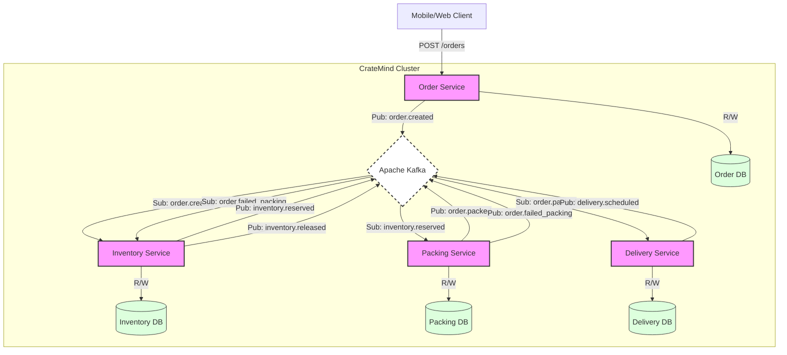
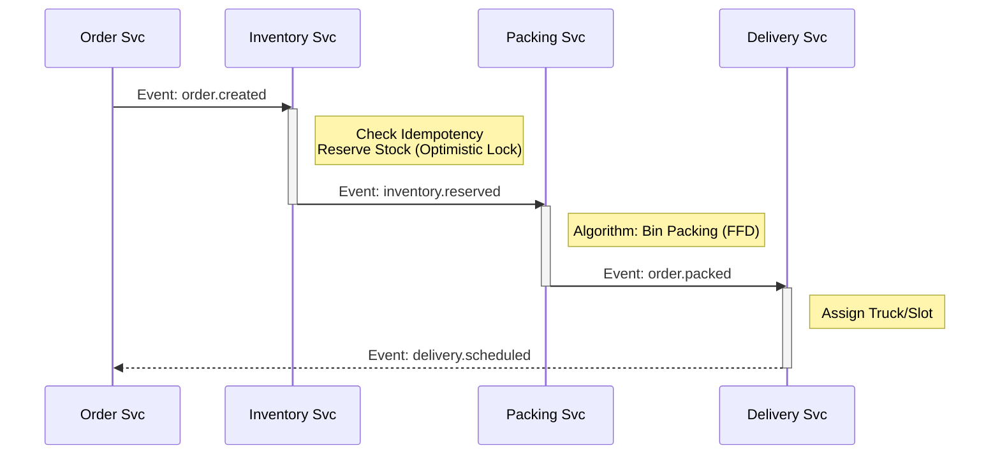
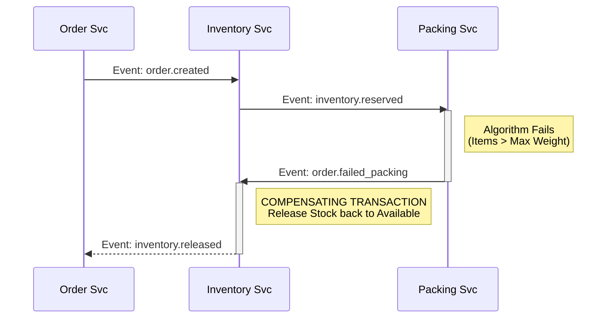

# CrateMind

**CrateMind** is an event-driven backend platform for online grocery delivery. It solves the problem of coordinating asynchronous orders with physical inventory and crate packing constraints.

### Core Objectives

1. **Distributed Consistency:** Managing state across microservices without 2-Phase Commit (2PC).
2. **Resilience:** Handling failures via Sagas and Compensating Transactions.
3. **Optimization:** Solving CPU-bound Bin Packing problems asynchronously.

---

## Architecture & Design

### High-Level System Landscape

> Rule: Services share nothing. No shared database tables. Communication is strictly via Kafka Events.
>
- **Order Service:** Ingests orders, validates, emits `order.created`.
- **Inventory Service:** Reserves stock (Optimistic Locking), handles Idempotency.
- **Packing Service:** Runs "First Fit Decreasing" algorithm (CPU heavy).
- **Delivery Service:** Assigns trucks and slots.



### The Saga Pattern (Choreography)

We use a choreography-based Saga to handle transactions.

Happy Path:

Order (Created) → Inventory (Reserved) → Packing (Packed) → Delivery (Scheduled)



**Compensation Path (Packing Failed):**

1. Packing Service fails (Item too heavy/big).
2. Emits `order.failed_packing`.
3. Inventory Service consumes failure event.
4. **Action:** Releases reserved stock back to `available_quantity`.
5. Emits `inventory.released`.



---

## Data Dictionary (Schema)

Order DB (order_db)

| **Table** | **Column** | **Type** | **Notes** |
| --- | --- | --- | --- |
| `orders` | `id` | UUID | PK |
|  | `customer_id` | VARCHAR |  |
|  | `status` | ENUM | `CREATED`, `PENDING`, `PACKED`, `FAILED` |
|  | `version` | INT | For optimistic locking |
|  | `created_at`  | TIMESTAMP |  |
| `order_items` | `id` | UUID | PK |
|  | `order_id` | UUID | FK -> orders.id |
|  | `product_id` | VARCHAR |  |
|  | `quantity` | INT |  |

Inventory DB (inventory_db)

| **Table** | **Column** | **Type** | **Notes** |
| --- | --- | --- | --- |
| `inventory` | `product_id` | VARCHAR | PK |
|  | `available_qty` | INT |  |
|  | `reserved_qty` | INT |  |
|  | `version` | INT | **CRITICAL:** Optimistic Lock |
| `idempotency_log` | `message_id` | UUID | PK (From Kafka Header) |
|  | `created_at` | TIMESTAMP |  |
|  | `status` | ENUM | `CREATED`, `PENDING`, `PACKED`, `FAILED` |

Packing DB (packing_db)

| **Table** | **Column** | **Type** | **Notes** |
| --- | --- | --- | --- |
| `packing_tasks` | `order_id` | UUID | PK |
|  | `status` | ENUM | `PENDING`, `COMPLETED`, `FAILED` |
|  | `failure_reason` | TEXT |  |
| `crates` | `id` | UUID | PK |
|  | `order_id` | UUID | FK -> packing_tasks |
|  | `type` | ENUM | `SMALL`, `MEDIUM`, `LARGE` |
|  | `weight` | INT | Grams |

Delivery DB (delivery_db)

| **Table** | **Column** | **Type** | **Notes** |
| --- | --- | --- | --- |
| `deliveries` | `id` | UUID | PK |
|  | `order_id` | UUID | FK |
|  | `delivery_slot` | TIMESTAMP |  |
|  | `truck_id` | VARCHAR |  |

---

## Repository Structure

```powershell
cratemind-platform/ (Root POM)
├── docker-compose.yml
├── pom.xml
│
├── cratemind-common/ (Shared JAR)
│   ├── src/main/java/com/cratemind/common/event/
│   │   ├── OrderCreatedEvent.java
│   │   └── ...
│
├── order-service/ (Spring Boot App)
│   ├── src/main/resources/
│   │   └── application.yml (Server Port: 8081)
│
├── inventory-service/ (Spring Boot App)
│   ├── src/main/resources/
│   │   └── application.yml (Server Port: 8082)
│
├── packing-service/ (Spring Boot App)
│   ├── src/main/resources/
│   │   └── application.yml (Server Port: 8083)
│
└── delivery-service/ (Spring Boot App)
    ├── src/main/resources/
        └── application.yml (Server Port: 8084)
```

---
## Local Development (Kubernetes)

A local Kubernetes setup to better mirror production, isolate resource-intensive services, and manage Kafka event bus effectively.

### Prerequisites
- [Minikube](https://minikube.sigs.k8s.io/docs/start/) or [Kind](https://kind.sigs.k8s.io/)
- `kubectl` configured

### Kubernetes Structure

```text
k8s/
├── base/
│   ├── zookeeper.yaml      # StatefulSet & Service (Port 2181)
│   ├── kafka.yaml          # StatefulSet & Headless Service (Port 9092)
│   ├── postgres.yaml       # StatefulSet, Secrets, & Storage (Port 5432)
│   └── postgres-init.yaml  # ConfigMap to split DB schemas
├── apps/
│   ├── microservices.yaml  # Deployments for Order, Inventory, and Delivery
│   └── packing-service.yaml# Deployment with isolated CPU limits (500m/2000m)
└── networking/
    └── ingress.yaml        # NGINX Ingress routing for api.cratemind.local
```
### Running the Cluster

1. **Start the foundation (Databases & Event Bus):**
```bash
kubectl apply -f k8s/base/
```

2. **Deploy the CrateMind microservices:**
```bash
kubectl apply -f k8s/apps/
```

3. **Expose the API Gateway:**
```bash
kubectl apply -f k8s/networking/ingress.yaml
```

4. **Update your `/etc/hosts` file:**

Map your local cluster IP to the ingress host:
```text
127.0.0.1 api.cratemind.local
```

*(Get the IP via `minikube ip` and use that instead of `127.0.0.1`)*

---

## Technical Appendix

### A. Service Port Registry

| **Service** | **App Port** | **DB Port (Host:Container)** | **Debug Port** |
| --- | --- | --- | --- |
| **Order Service** | `8081` | `5432:5432` | `5005` |
| **Inventory Service** | `8082` | `5433:5432` | `5006` |
| **Packing Service** | `8083` | `5434:5432` | `5007` |
| **Delivery Service** | `8084` | `5435:5432` | `5008` |
| **Kafka Broker** | N/A | `9092` (External) | N/A |
| **Zookeeper** | N/A | `2181` | N/A |

### B. Kafka Topic Registry

| **Logic Flow**     | **Topic Name**      | **Partitions** |
|--------------------|---------------------| --- |
| Order Created      | `order.created`     | 3 |
| Order Packed       | `order.packed`      | 3 |
| Packing Failed     | `order.failed_packing` | 3 |
| Stock Reserved     | `inventory.reserved` | 3 |
| Stock Released     | `inventory.released` | 3 |
| Delivery Scheduled | `delivery.scheduled` | 3 |
| Delivery Failed    | `delivery.failed`   | 3 |
| **DLQ Pattern**    | `{original_topic}.dlq` | 1 |
